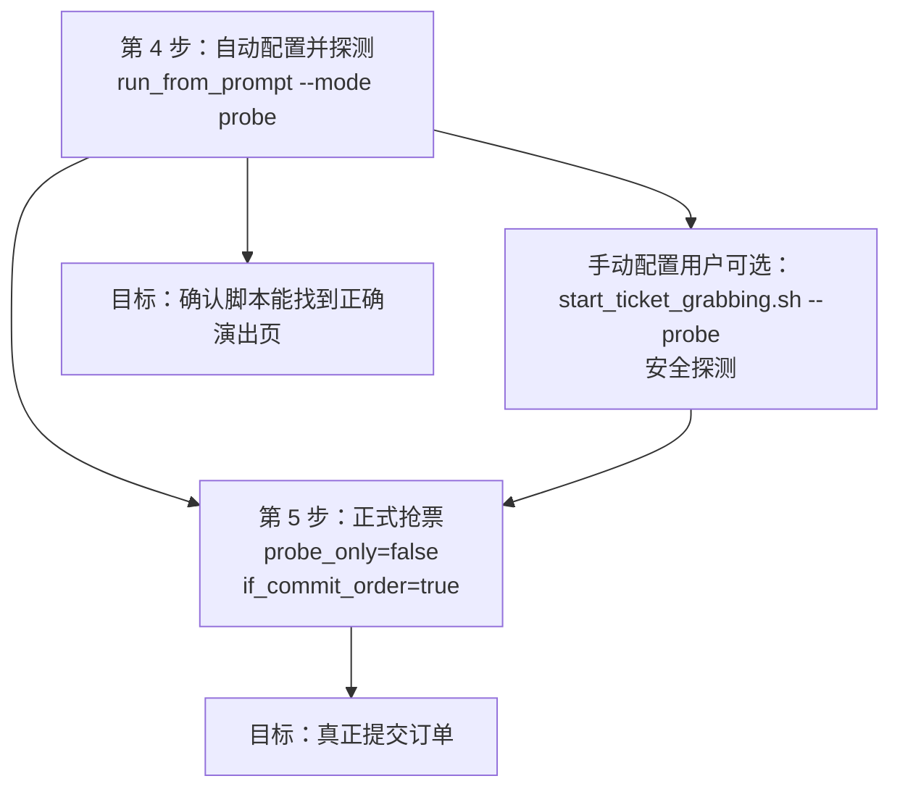

# HaTickets - 大麦抢票自动化

这个仓库不是票务展示站，而是一个“大麦抢票自动化工具箱”。

## 法律说明

- 开源协议：见 [LICENSE](./LICENSE)
- 版权与商标声明：见 [NOTICE](./NOTICE)
- 免责申明：见 [DISCLAIMER.md](./DISCLAIMER.md)

## 当前状态

- `Mobile`：当前主推方案，也是 README 主要说明对象
- `Web`：保留，适合会调 Selenium 的用户
- `Desktop`：**已被官方渠道限制，当前视为不可用，不再推荐，也不要作为主流程投入时间**

## 方案状态

| 方案 | 目录 | 当前状态 | 说明 |
|------|------|--------|------|
| `Mobile` | `mobile/` | 主推 | 走 Android 大麦 App，最接近真实购票流程 |
| `Web` | `web/` | 可用但次选 | Selenium 控制 Chrome |
| ~~`Desktop`~~ | ~~`desktop/`~~ | ~~不可用~~ | ~~官方渠道和风控已限制，当前不要再作为可执行方案使用~~ |

> 如果你是第一次用，直接走 `Mobile + 安卓真机`。
> 如果你是手动配置用户，想先验证流程，直接用 `./mobile/scripts/start_ticket_grabbing.sh --probe --yes`。
> 如果你看到旧文档里提到 `Desktop`，把它理解成“历史实现”，不要再按它准备环境。

**当前主流程按 `Mobile + 安卓真机` 设计。**

先定位目标演出，再进入票档页和确认页；如果配置了 `item_url + auto_navigate`，脚本可以从大麦首页自动搜到目标演出。

现在命令语义固定为：

- `./mobile/scripts/start_ticket_grabbing.sh --probe --yes`：安全探测
- `./mobile/scripts/start_ticket_grabbing.sh --yes`：正式抢票

如果当前配置里的 `probe_only / if_commit_order` 和你执行的命令不一致，脚本会先用醒目的日志提醒你，再自动改写配置并继续执行。

## 推荐阅读顺序

1. 先看下面的 `五分钟跑通 Mobile`
2. 再看 [docs/quick-start.md](docs/quick-start.md)
3. 需要深入理解脚本时，再看 [docs/mobile-ticket-logic.md](docs/mobile-ticket-logic.md)

## 五分钟跑通 Mobile

按当前代码，最稳定的路线就是这一条：

1. 连接安卓真机，并保持大麦 App 已登录
2. 启动 Appium
3. 自动配置并直接做一次安全探测
4. 探测通过后，再进入正式抢票

这 2 个用户阶段一定要区分清楚：

1. `./mobile/scripts/start_ticket_grabbing.sh --probe --yes`
   只是探测。会自动打开目标演出页，但会停在“立即购票/立即预订”之前，不会真正点击。
2. `./mobile/scripts/start_ticket_grabbing.sh --yes`
   才是正式提交模式，会尝试提交订单。

### 1. 安装依赖

```bash
poetry install
npm install -g appium
appium driver install uiautomator2
```

如果你还没有 Android SDK，建议直接安装 Android Studio。

### 2. 连接手机

手机前置条件：

- 已打开 `开发者选项`
- 已打开 `USB 调试`
- 已安装并登录大麦 App

连接后执行：

```bash
adb devices
```

输出里类似 `ABC1234567	device` 的这一串，就是你的 `udid`。

### 3. 启动 Appium

```bash
./mobile/scripts/start_appium.sh
```

这一步会启动一个本地 Appium 服务，需要持续保持运行。

建议做法：

1. 用第一个终端窗口执行 `./mobile/scripts/start_appium.sh`
2. 不要关闭这个终端，也不要按 `Ctrl+C`
3. 再打开第二个终端窗口，继续执行后面的抢票命令

这一步会顺带检查：

- Android SDK
- 已连接设备
- 大麦 App 是否安装
- Appium 服务是否成功启动

### 4. 准备本地配置

开始前先确认这两件事：

- 真机里已经安装并登录大麦 App
- 你要用到的观演人已经在大麦 App 里添加成功

#### 4.1 自动配置
如果你不想一开始就手改配置，可以先用自然语言入口。前面 3 个步骤都完成后，再看这一节。

先记住这几条：

- 常用模式都建议直接写清楚观演人姓名
- 如果提示词里没写观演人，脚本会立即停止
- 如果你已经写了多个观演人，但没额外写“2张”，脚本会自动按观演人数推断购票数量
- 只有当你手动写了张数、且和观演人数不一致时，脚本才会停止
- 这种情况下不会继续搜索、连接 Appium，也不会写配置
- 脚本会直接打印“可复制的正确命令”和“规范提示词”，你按输出替换后重试即可
- 如果当前只连接了一台安卓设备，脚本会自动识别并临时修正 `udid / platform_version`
- 在 `apply / probe` 模式下，这两个设备字段也会一起写回 `mobile/config.jsonc`
- 推荐提示词格式：`给张三和李四抢4 月 6 号张杰的北京站演唱会内场门票，票价 1680 元`
- 使用时请把 `张三`、`李四` 替换成你自己已经在大麦 App 中添加成功的真实观演人姓名

常用 3 个模式的关系要先看清楚：

- `summary`：只预览，不写配置
- `apply`：写入 `mobile/config.jsonc`，适合你想自己再检查一遍配置
- `probe`：写入 `mobile/config.jsonc`，并直接执行一次安全探测

和下面第 4、5 步的对应关系是：

- `probe` 对应第 4 步：安全探测
- 第 5 步才是正式抢票；为了避免误下单，`run_from_prompt` 不直接提供自动提交模式

如果你只是想先看看 AI 识别得对不对，运行：

```bash
./mobile/scripts/run_from_prompt.sh --mode summary --yes "给张三和李四抢4 月 6 号张杰的北京站演唱会内场门票，票价 1680 元"
```

注意：

- `summary` 能稳定给出搜索候选
- 日期和票档摘要取决于页面当前是否已经展开到可识别状态，显示 `未识别` 也算正常，不代表脚本失效

如果你确认摘要结果没问题，并且想只生成配置文件，运行：

```bash
./mobile/scripts/run_from_prompt.sh --mode apply --yes "给张三和李四抢4 月 6 号张杰的北京站演唱会内场门票，票价 1680 元"
```

执行完 `apply` 后，直接跳到下面第 5 步继续即可，不需要再回头看 4.2。

如果你想“生成配置 + 直接做安全探测”，运行：

```bash
./mobile/scripts/run_from_prompt.sh --mode probe --yes "给张三和李四抢4 月 6 号张杰的北京站演唱会内场门票，票价 1680 元"
```

这就是普通用户最推荐的探测方式。
也就是说，如果你已经在用自然语言入口，通常**不需要**再单独执行一次 `./mobile/scripts/start_ticket_grabbing.sh --probe --yes`。

#### 4.2 手动配置

如果你没有用 4.1 自动生成配置，或者你已经用 4.1 生成过配置、现在只是想手动检查和微调，再看这一节。

普通用户直接维护 [mobile/config.jsonc](./mobile/config.jsonc) 即可；如果文件被你改乱了，可以先用模板覆盖：

```bash
cp mobile/config.example.jsonc mobile/config.jsonc
```

然后把下面这几个字段改成你自己的真实值：

```jsonc
{
  "server_url": "http://127.0.0.1:4723",
  "device_name": "Android",
  "udid": "你的 adb devices 序列号",
  "platform_version": "你的安卓版本",
  "app_package": "cn.damai",
  "app_activity": ".launcher.splash.SplashMainActivity",
  "item_url": "https://m.damai.cn/shows/item.html?itemId=你的 itemId",
  "keyword": null,
  "users": ["你已经在大麦 App 中添加成功的观演人姓名"],
  "city": "你的演出城市",
  "date": "你的场次日期",
  "price": "你的票档原文",
  "price_index": 0,
  "if_commit_order": false,
  "probe_only": true,
  "auto_navigate": true
}
```

字段说明只记最关键的：

- `item_url`：推荐填大麦详情页链接，脚本会自动提取 `itemId`
- `keyword`：如果 `item_url` 已可用，可以填 `null`
- `users`：必须是你已经在大麦 App 里添加成功的真实观演人；人数就是购票张数
- `city / date / price`：尽量按 App 页面上的原文填写
- `price_index`：文本匹配失败时的兜底索引，从 `0` 开始
- `probe_only=true`：脚本内部使用的探测标记；普通用户优先使用 `--probe`
- `if_commit_order=false`：脚本会继续到确认页并执行观演人勾选校验，但会停在“立即提交”前；正式抢票时 `start_ticket_grabbing.sh --yes` 会自动改成 `true`
- `auto_navigate=true`：允许脚本从首页/搜索页自动进入目标演出

如果你是手动配置用户，完成这一步后，可以直接用下面这条命令做一次安全探测：

```bash
./mobile/scripts/start_ticket_grabbing.sh --probe --yes
```

探测通过的标志是：

- 脚本能自动控制大麦 App
- 能自动定位到目标演出页
- 在购票点击前停止

如果你执行后看到脚本停在详情页，不代表脚本坏了；这正是 `--probe` 的预期行为。

开发者补充说明：

- `mobile/config.local.jsonc` 是可选的本地覆盖配置
- 它不会提交到 GitHub，适合开发调试时放真机参数
- 普通用户默认始终使用 [mobile/config.jsonc](./mobile/config.jsonc)
- 如果你是开发者，需要显式通过 `--config mobile/config.local.jsonc` 或 `HATICKETS_CONFIG_PATH=mobile/config.local.jsonc` 才会启用本地覆盖配置

#### 4.3 如果演唱会 12:00 开抢，建议几点启动脚本

这个项目不是“11:59:59 再手忙脚乱点一次”的思路，而是**提前把环境和页面准备好，再在开售瞬间进入热路径**。

实操建议：

- 如果你已经手动停在目标演出详情页或票档页：提前 **1 到 2 分钟**
- 如果你还要依赖自动导航、自动搜索、自动切页：提前 **3 到 5 分钟**
- 如果是第一次跑、网络一般、手机状态不稳定：提前 **5 分钟以上**

也就是说，如果开抢时间是 `12:00`，最稳妥的做法是：

- 至少在 **11:58** 前启动 `./mobile/scripts/start_ticket_grabbing.sh --yes`
- 更保守一点，直接在 **11:55 到 11:58** 之间启动

推荐配置分两种：

1. 你知道精确开抢时间
   这是最推荐的方式。脚本会在开抢前 `countdown_lead_ms` 毫秒进入紧密轮询。

```jsonc
"sell_start_time": "2026-04-06T12:00:00+08:00",
"countdown_lead_ms": 3000,
"wait_cta_ready_timeout_ms": 0
```

这组配置的含义是：

- 精确等到 `12:00`
- 从 `11:59:57` 开始高频轮询
- 不走“最长等待 CTA 60 秒”的备用策略

2. 你不知道精确开抢时间，但会手动停在倒计时详情页
   这时可以不填 `sell_start_time`，改用 CTA 等待模式。

```jsonc
"sell_start_time": null,
"wait_cta_ready_timeout_ms": 60000
```

这组配置适合“我会提前守在详情页，等按钮从倒计时变成立即购买”的场景，但也更容易让人误以为脚本卡住了。对大多数普通用户来说，如果你已经知道开抢时间，优先用第一种配置。

### 5. 正式提交前再确认一次

这一步才是**真正的抢票**。

建议你把它理解成：

- 第 4 步验证“脚本能不能找到正确的演出页”
- 第 5 步才是“允许脚本真正提交订单”

如果你是从 4.1 自动配置开始的，到了这里通常不需要重新生成配置，直接执行：

```bash
./mobile/scripts/start_ticket_grabbing.sh --yes
```

这条命令会固定按“正式抢票”运行。

如果你当前配置里还是：

```jsonc
"probe_only": true,
"if_commit_order": false
```

脚本会先给出醒目的提示，再自动把它们改成：

```jsonc
"probe_only": false,
"if_commit_order": true
```

然后继续执行。

预期逻辑是：

1. 脚本读取你在第 4 步已经探测通过的配置
2. 自动进入目标演出页或直接从当前页继续
3. 自动选择场次、票档、数量和观演人
4. 到达“确认购买”页
5. 这一次会继续点击“立即提交”
6. 如果下单成功，通常会进入支付页；后续支付需要你自己完成

可以把 4、5 两步理解成这张图：



第 5 步最容易出问题的地方，也建议你在开始前再核对一次：

- `users` 是否就是本次实际要购票的观演人
- `price` 和 `price_index` 是否已经在前面的探测和人工检查里确认过
- 当前票档是不是可买状态，而不是“缺货登记”或“预约”
- 手机和网络是否稳定，且大麦 App 仍然保持登录

如果第 5 步失败，优先这样排查：

1. 如果目标项目已经开售，但根本没有进入确认页，通常是 `price / price_index / city / date` 其中一项没对上
2. 如果进入确认页但没提交成功，先检查是否触发了验证码、库存不足或已有未支付订单
3. 如果跳到了别的演出页，说明当前页面状态不干净，先回到大麦首页再重新执行
4. 如果日志里提示找不到观演人，先确认这些观演人已经在大麦 App 中添加并保存成功

如果你知道演唱会是 `12:00` 开抢，第 5 步开始前再记住这一条：

- 不要等到 `11:59:59` 才运行脚本
- 已经验证过流程的情况下，至少提前 **1 到 2 分钟**
- 需要自动导航或想更稳一点，提前 **3 到 5 分钟**
- 绝大多数场景下，**11:55 到 11:58 启动**会比掐秒启动更稳

## 常见问题

### 1. `adb: command not found`

说明 Android SDK 的 `platform-tools` 没进环境变量。
最直接的办法是：

```bash
export ANDROID_HOME="$HOME/Library/Android/sdk"
export ANDROID_SDK_ROOT="$ANDROID_HOME"
export PATH="$ANDROID_HOME/platform-tools:$PATH"
```

### 2. `adb devices` 看不到手机

先检查：

1. 手机有没有打开 `USB 调试`
2. 数据线是不是只能充电不能传数据
3. 手机上有没有点“允许调试”

### 3. 打开大麦后提示“访问被拒绝”

这通常是风控，不一定是代码问题。
模拟器比真机更容易触发，所以推荐用真机。

### 4. 脚本找不到观演人

最常见原因是：

- [mobile/config.jsonc](./mobile/config.jsonc) 里的 `users` 写的是占位符，不是真实名字
- 你的大麦账号里还没有配置对应观演人

### 5. 脚本没有进入确认页

通常先查这几项：

1. `price` 文本是不是填错了
2. `price_index` 是不是和实际票档不一致
3. 当前票档是不是“缺货登记”而不是可买状态

### 6. 为什么脚本停在详情页，没有继续点“立即购票”

最常见的原因不是脚本坏了，而是当前还在安全探测模式。

先看你执行的是不是这条命令：

```bash
./mobile/scripts/start_ticket_grabbing.sh --probe --yes
```

如果是，这就是预期行为。`--probe` 会故意停在详情页购票按钮前，不会真正点击。

如果你想正式开始抢票，直接执行：

```bash
./mobile/scripts/start_ticket_grabbing.sh --yes
```

如果当前配置里还是探测模式，这条命令会先用醒目的日志提示你，然后自动把配置切到正式抢票模式再继续执行。

另外再检查：

1. `wait_cta_ready_timeout_ms` 是否设置得过大，导致脚本还在等待 CTA 就绪
2. `city` 是否和详情页上的实际文本不一致，导致预选失败
3. 当前项目是否其实还是“预约/预售”流程，而不是真正可下单流程
4. 当前项目是不是只支持 App，不支持 H5 / Web

## 其他方案

### Web 端

适合已经熟悉 Selenium 的人。它还在仓库里，但不再是默认推荐路线。

```bash
cd web
python damai.py
```

首次运行会打开 Chrome 登录，配置文件是 [web/config.json](./web/config.json)。

### Desktop 端

`Desktop` 方案保留代码和历史文档，但当前已经不作为可用方案推荐。

原因很简单：

- 这条路线依赖大麦 H5 / mtop 接口
- 当前官方渠道限制和风控已经让这条方案失去稳定可用性
- 继续折腾 `desktop` 的投入产出很差

如果你只是想真正跑通抢票流程，请回到上面的 `五分钟跑通 Mobile`。

```bash
cd desktop
yarn install
yarn tauri dev
```

## 项目结构

```text
HaTickets/
├── mobile/                  # Android App 自动化
├── web/                     # Selenium 浏览器自动化
├── desktop/                 # Tauri + Rust 桌面端
├── docs/                    # 文档、流程图、说明图
├── tests/                   # pytest 测试
└── pyproject.toml           # Python 依赖
```

## 开发与测试

```bash
poetry install
poetry run pytest
```

## 免责声明

仅供学习和研究使用。请自行承担使用风险，并遵守平台规则。更完整的说明见 [DISCLAIMER.md](./DISCLAIMER.md)。
