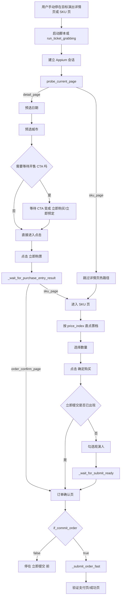
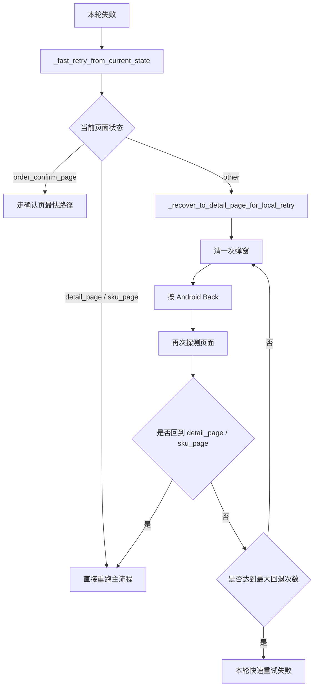
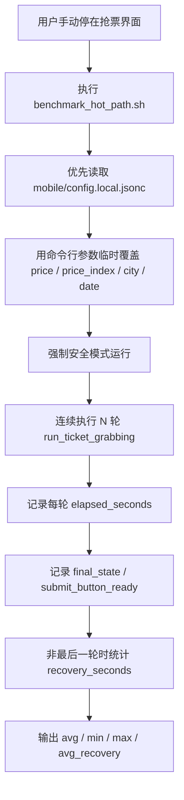

# Mobile Hot Path Workflow Design

## 背景

这个方案针对的是移动端实战模式：

- 用户自己先把手机停在目标演出的详情页或 SKU 页
- 脚本不负责从首页导航到演出页
- 脚本只负责最后一段热路径
- 如果失败，优先在当前会话里本地回退再重试，不先重建 driver

核心目标有两个：

1. 压缩 `立即购票 -> 票档 -> 确定购买 -> 立即提交出现` 这一段时间
2. 失败后尽快回到可继续重试的详情页或 SKU 页

配套图文件：

- 可编辑源文件：[`../移动端热路径工作流.drawio`](../移动端热路径工作流.drawio)
- 静态图片：[`../images/移动端热路径工作流.png`](../images/移动端热路径工作流.png)

## 主热路径

## 失败后的本地快速回退

## Benchmark 工作流

压测脚本入口是 `./mobile/scripts/benchmark_hot_path.sh`，它会强制覆盖成安全参数：

- `if_commit_order=false`
- `auto_navigate=false`
- `rush_mode=true`

压测流程如下：

## 关键设计选择

### 为什么实战时优先相信 `price_index`

因为大麦 SKU 页经常不稳定暴露票档文本：

- 有时只暴露价格数字
- 有时文本完全不进无障碍树
- 有时只能靠 OCR 补读

所以实战热路径里，优先用已经通过验证的 `price_index` 直点票档，速度更快，也更稳定。

### 为什么失败后不先重建 driver

因为手动起跑模式下，用户已经把手机停在正确页面附近了。此时先 `driver.quit()` 再重建：

- 会浪费时间
- 可能把页面打回首页或别的初始态
- 会把“局部失败”扩大成“整链路重走”

所以当前策略是优先在当前会话里做本地回退，只在自动导航模式下才保留重建 driver 的逻辑。
